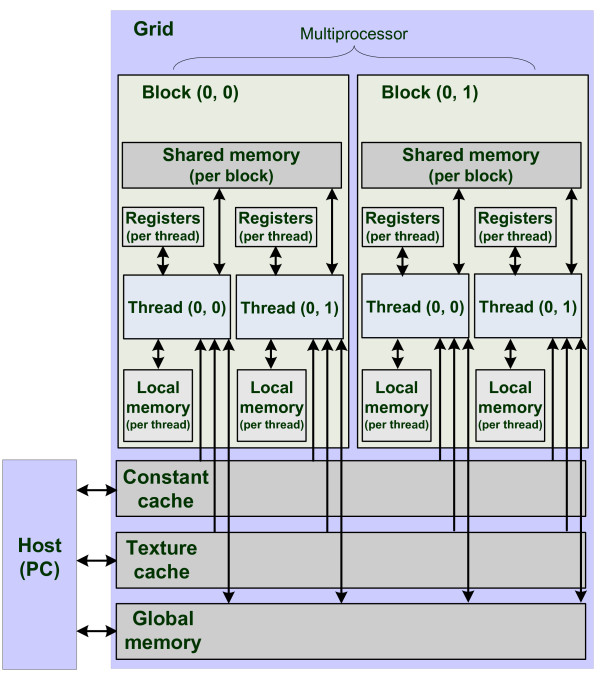

#CUDA Programming Personal Repositories

- repo5
    - How to call CUDA C Thread 
    - How to communicate between threads
    - How to synchronize threads running in parallel
    - Wave Julia Set
    
    
    - __ syncthreads() performance
        - No Synchronize Threads
            
           
        - Synchronize Threads
                

- repo6
    - How to use constant memory by using CUDA C
    - Characteristics of constant memory
    - How to evaluate the performance of CUDA application by using CUDA event
    - CUDA Memory Hierarchy
        
    
    

- Compile Command
    - nvcc -o main main.cpp -lGL -lglut -x cu
    
    
- reference
    - https://m.blog.naver.com/PostView.nhn?blogId=riverrun17&logNo=220420579990&proxyReferer=https:%2F%2Fwww.google.com%2F
    - https://www.researchgate.net/figure/Memory-model-CUDA-memory-hierarchy_fig2_51529494