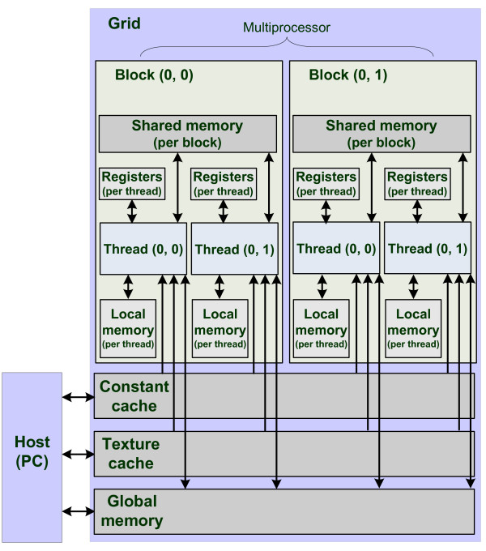

#REPO6

- repo6
    - How to use constant memory by using CUDA C
    - Characteristics of constant memory
    - How to evaluate the performance of CUDA application by using CUDA event
    - CUDA Memory Hierarchy
        
    
- **Bottle Neck** of hundreds of ALU in GPU is caused by GPU's memory bandwidth, not total workload of GPU
    - It is not enough fast to come Input data into GPU
    - It is not matter of the number of ALU
    - It is important to reduce the memory workload

- NVIDIA HW normally provides 64KB constant memory
    - If an user implements constant memory instead of global memory, it is possible to reduce the memory bandwidth

- Ray Tracing Example by Using Constant Memory
    - Ray tracing: Method to make an object in 3D project to 2D image
    - Raserization method
        - To locate virtual camera, one point is selected in scene
        - To visualize an image, the camera has light sensor
        - It should be figured out which light contacts the light sensor
        - Each pixel in a result image should bs same about ray color and intensity, which is contacted to spot sensor
        - image --- view ray ----> scent object
    - Simply, the example is,
        - each pixel emits one view ray
        - it tracks which a part in a sphere is contacted by the ray
        - it records depth of the point contacted by the ray
                
    - hit method
        - When ray is projected from ox, oy pixel, this method confirms whether the ray is cross the sphere
    
    - cudaMemcpyToSymbol()
        - cudaMemvpy's special version for constant memory
        - It is copying the host memory to constant memory
        - cudaMemcpy with cudaMemcpyHostToDevice is copying the host memory to global memory
        - __ constant __ is needed
            - the memory is 'read-only' type memory
        
- Why can constant memory, reading only 64KB memory, reduce bandwidth rather than reading global memory      
    - A single read from constant memory can be broadcast to other adjacent threads, effectively saving up to 15 reads
    - Constant memory is cached, so consecutive reads of the same address will not incur any additional memory traffic
    
- Warp
    - In the CUDA architecture, a warp refers to a collection of 32 threads that are woven together and get executed in lockstep
    - At every line in a program, each thread in a warp executes the same instruction on different data
    - When it comes to handling constant memory, GPU can broadcast a single memory read to each half-warp
    - A half-warp is a group of 16 threads
    - If every thread is a half-warp requests data from the same address in constant memory, GPU will generate only a single read request
    and subsequently broadcast the data to every thread
    - If you are reading a lot of data from constant memory, you will generate only 1/16 of the memory traffic as you would when using global memory
    - There can be potentially be a downside to performance when using constant memory
        - The half-warp broadcast feature is in actuality a double-edged sword.
        - Although it can dramatically accelerate performance when all 16 threads are reading the same address,
        it actually slows performance to a crawl when all 16 threads read different addresses.
        - If all 16 threads in a half-warp need different data from constant memory, the 16 different reads get serialized, effectively taking 16 times the amount of time to place the request
        
    
- Time stamp
    - Creating an event and subsequently recording an event        
    - cudaEventCreate() -> cudaEventDestroy()
    